# 👑 CEYLORA | Luxury Fragrance Signature
[](https://ceylorasignature.com/)

An elegant e-commerce platform for luxury perfumes, built with PHP and MySQL. Designed for a premium shopping experience.

---

## 📸 Project Showcase

### 🏠 Home Page
Luxury interface designed for a premium fragrance experience.
<p align="center">
  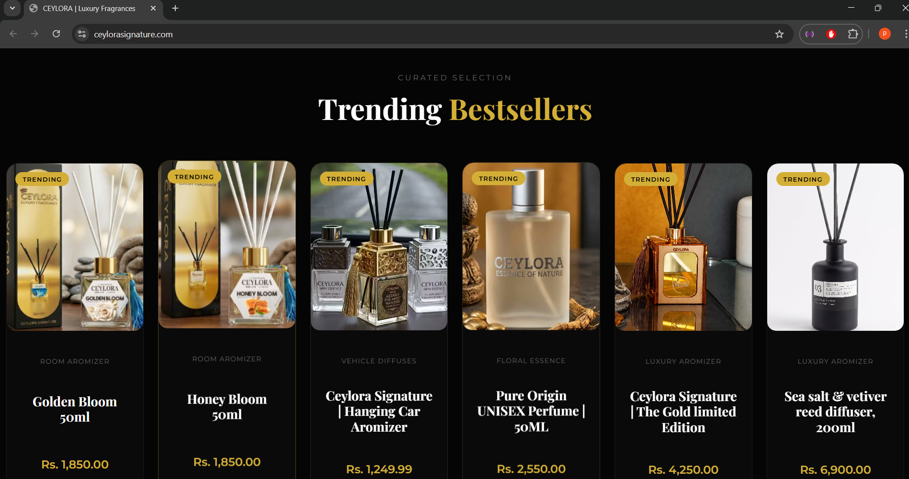
</p>
<p align="center">
  
  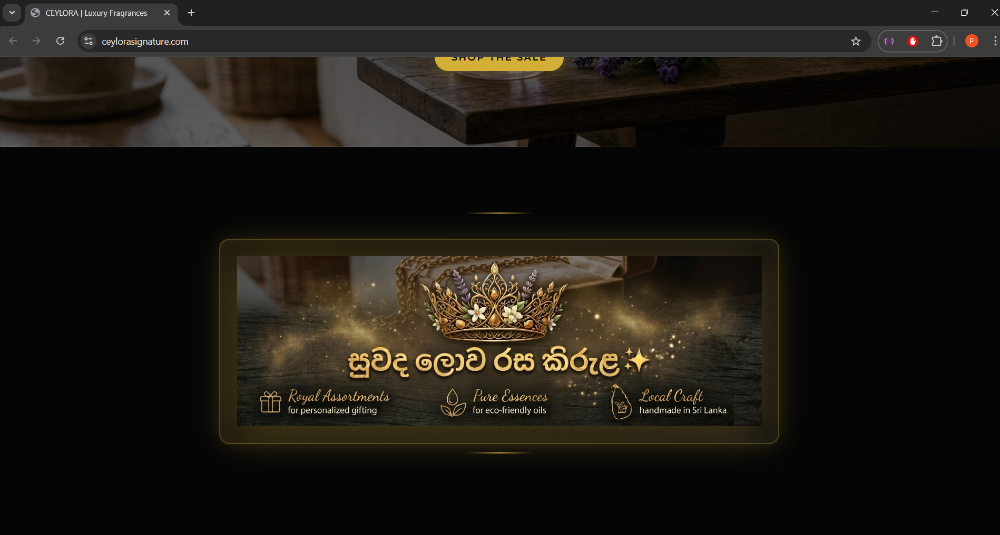
</p>

---

### 🛍️ Shop & Products
Fully dynamic product listing and detail views.
<p align="center">
  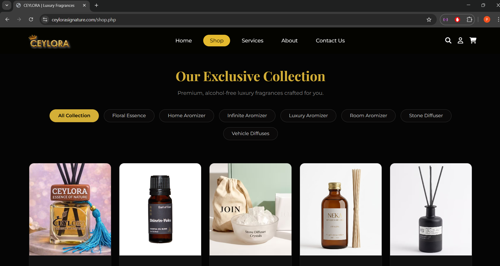
  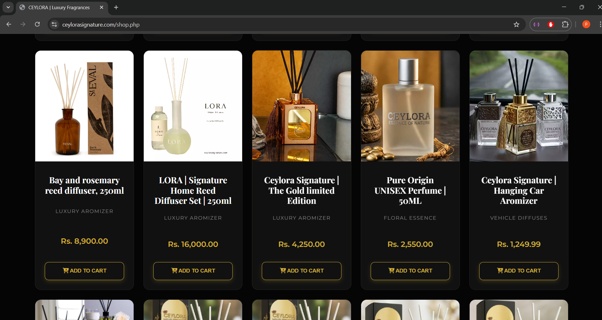
</p>

---

### 🛠️ Services
Premium services offered by Ceylora.
<p align="center">
  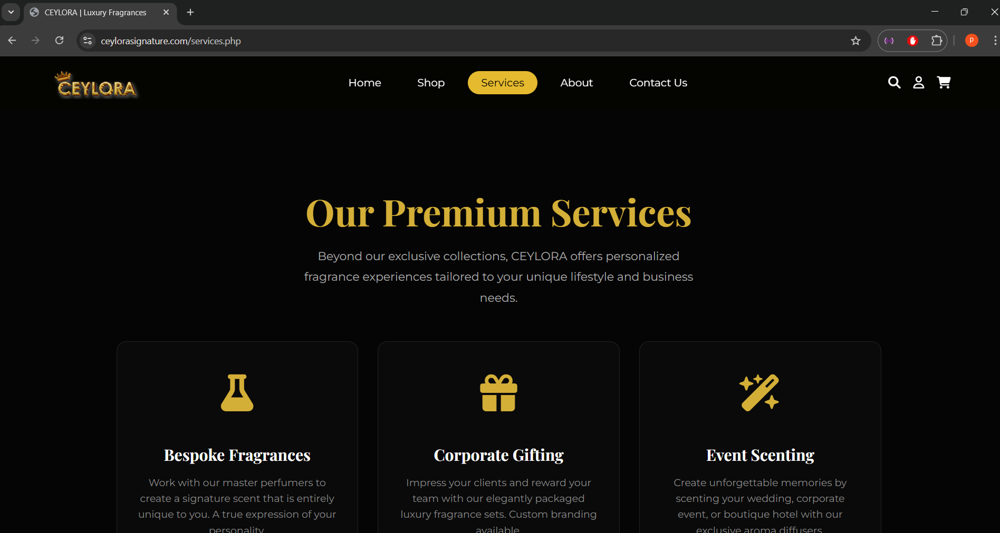
  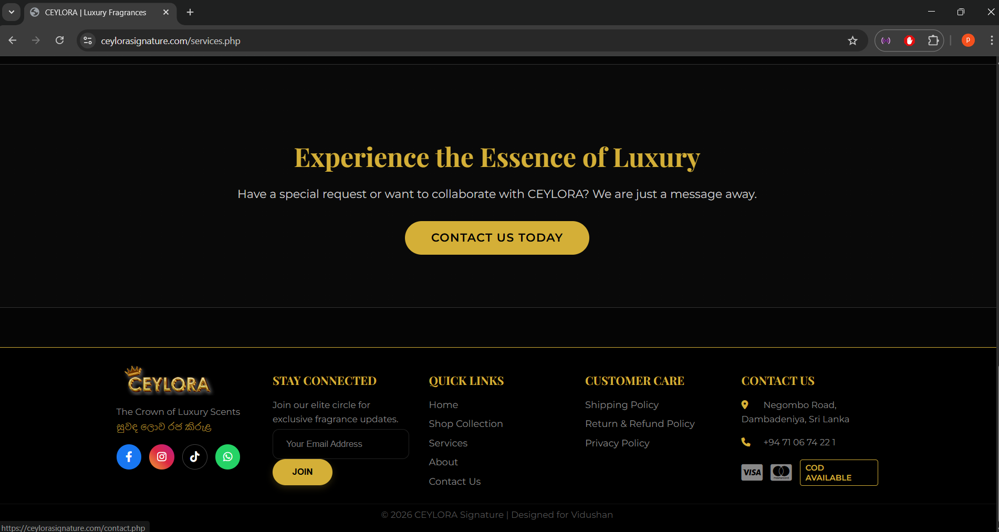
</p>

---

### 📖 About Us
The story and mission behind the brand.
<p align="center">
  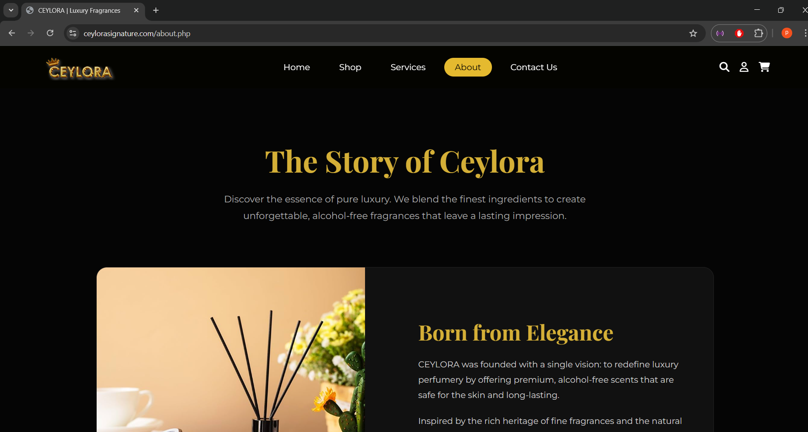
  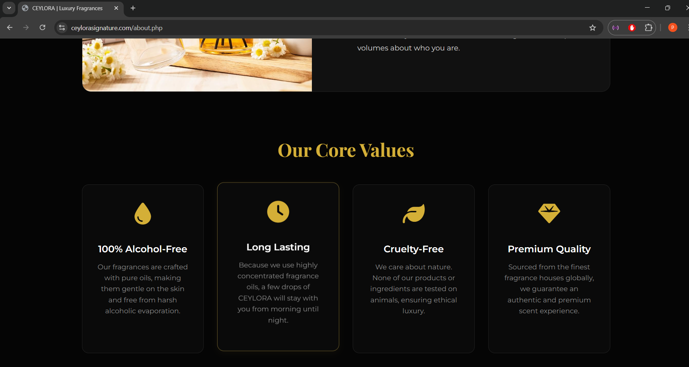
</p>

---

### 📞 Contact Us
Customer inquiry and contact interface.
<p align="center">
  
</p>

---

### 🔐 Admin Dashboard
Comprehensive management system for products, orders, and inquiries.
<p align="center">
  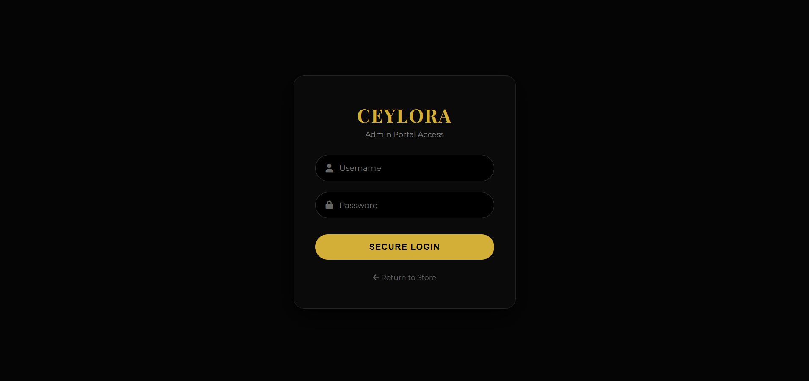
  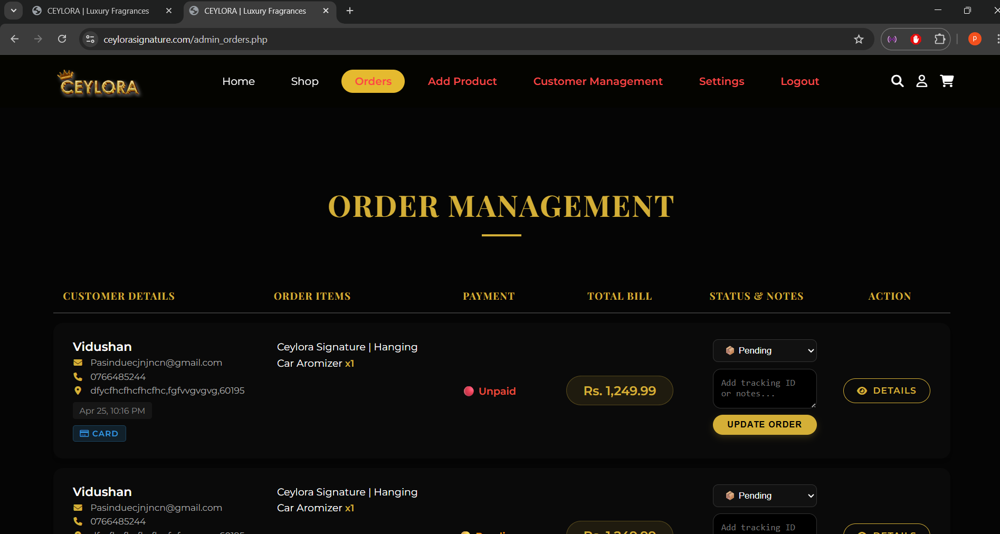
</p>
<p align="center">
  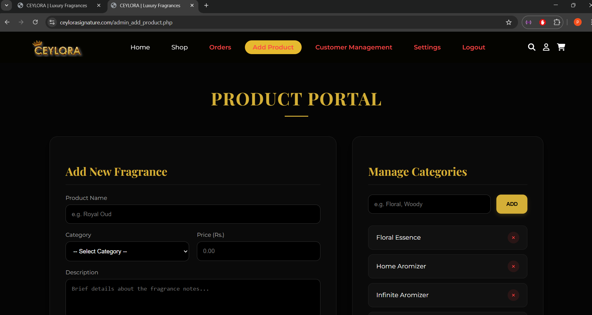
  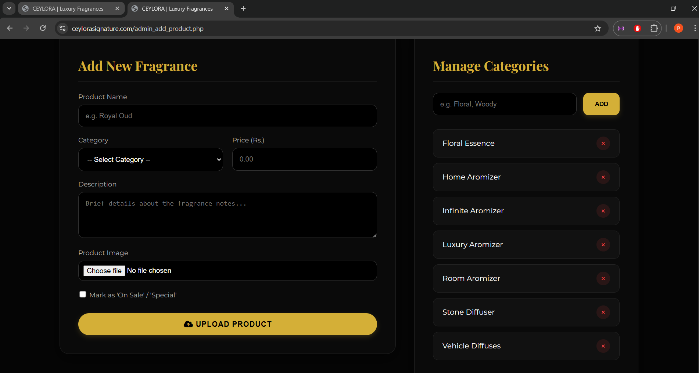
  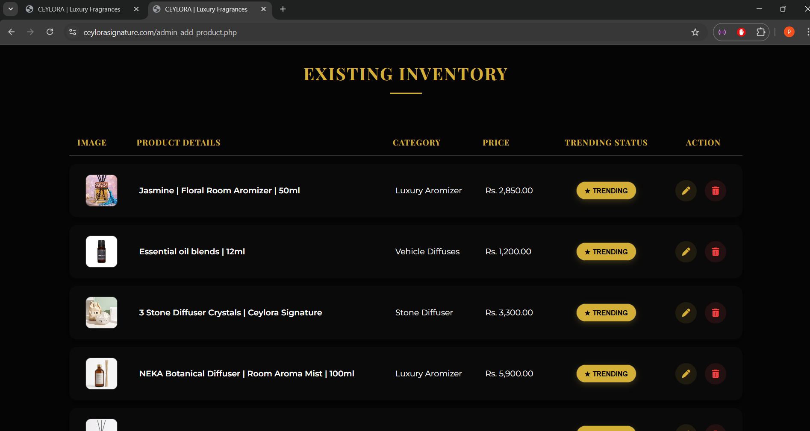
  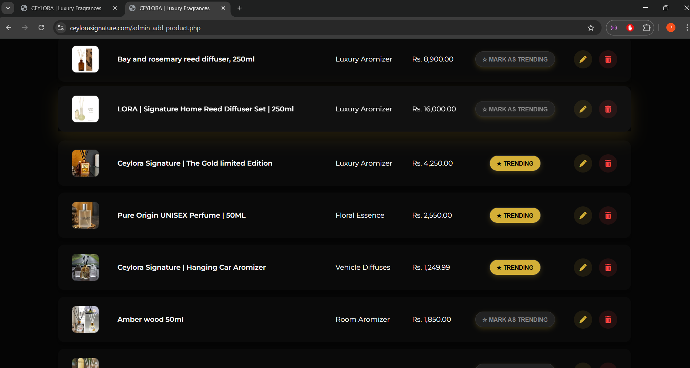
</p>

---

## ✨ Key Features
- **Premium UI/UX:** Clean, dark-themed design with a luxury aesthetic.
- **Dynamic Shop:** Fully functional product listing and detail pages.
- **Secure Shopping:** Integrated cart system and checkout.
- **Admin Dashboard:** Manage products, orders, and user inquiries effortlessly.
- **Responsive Design:** Optimized for Desktop, Tablet, and Mobile devices.

---

## 🛠️ Tech Stack


---

## 🚀 Local Installation & Setup
Since sensitive configuration files are ignored for security, follow these steps to run the project locally:

1. **Clone the repository:**
   ```bash
   git clone [https://github.com/pasinduvidushan258/ceylora.git](https://github.com/pasinduvidushan258/ceylora.git)
